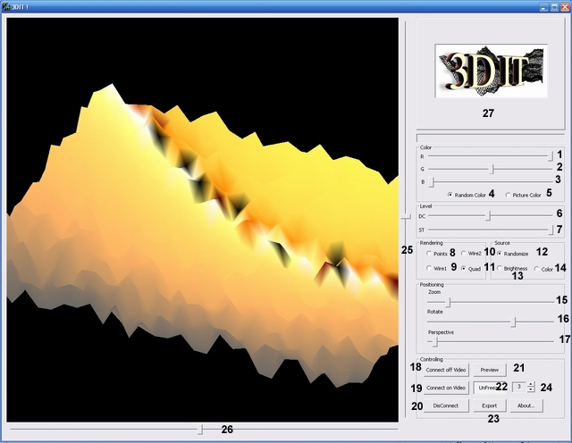

# Real-time surface terrainer with image processing
===================

This program generates 3D terrains from a video source by image processing. It is a good starter for your own Remote Sensing, Remote Topography, Captcha, Radar, GPS and make real 3D maps by CNC machines projects.

How to use:

 1. Run the program and with 8, 9, 10, 11 radio buttons (below picture) see random real time noise. Freeze the scene with button number 22 and with another controls new results are ready.
 2. Connect it to a video source (for example a web cam) and then click at buttons number 18 or 19 and then click on 13 (Brightness) or 14 (Color) radio buttons and see 3d video.

Compile:
You need OpenGL library for Win or linux.
**Note:** these instructions are for win.
glut32.dll to %WinDir%\System32,
glut.h     to $(MSDevDir)\Vc7\include\GL\
glut32.lib $(MSDevDir)\Vc7\lib\

By Numbers:

·        1,2,3 : Model color adjusting

·        4: color adjusting in Random Model

·        5: color adjusting when we are in video source mode and brightness mode of video.

·        6: DC offset or threshold of terrains in model. (works only in video mode)

·        7: Steps of rendering. (space of polygons)

·        8: render mode of model by points.

·        9: render mode of model by wire. (Mode 1)

·        10: render mode of model by wire. (Mode 2).

·        11: render mode of model by Quads.

·        12: program works in Random Terrains mode.

·        13: program works in Brightness Terrains mode. (video mode)

·        14: program works in Video Color Terrains mode. (video mode)

·        15: zoom in 3d model.

·        16: rotating 3d model.

·        17: changes 3d model perspective view.

·        18: connecting to video capture source without any preview.

·        19: connecting to video capture source with preview.

·        20: disconnecting from video source.

·        21: preview of video off or on.(if by capture driver supported)

·        22: freezing current rendered model.

·        23: export model to file.

·        24: steps of rotating speed.

·        25, 26: scrolling the model in view board.

·        27: video preview area.

 

Shortcuts:

·        Arrow keys Left & Right: for rotating the model.

·        + & - : for zooming.

·        Home: for reset view of rotation.

·        A: about.

·        C: connecting to video source video preview is on.

·        O: connecting to video source video preview is off.

·        P: preview on or off (your capture driver must support).

·        E: exporting program current 3d model.(I hope write its viewer asap!)

·        D: disconnect from video source or end capturing.

·        F: freeze the current view.
